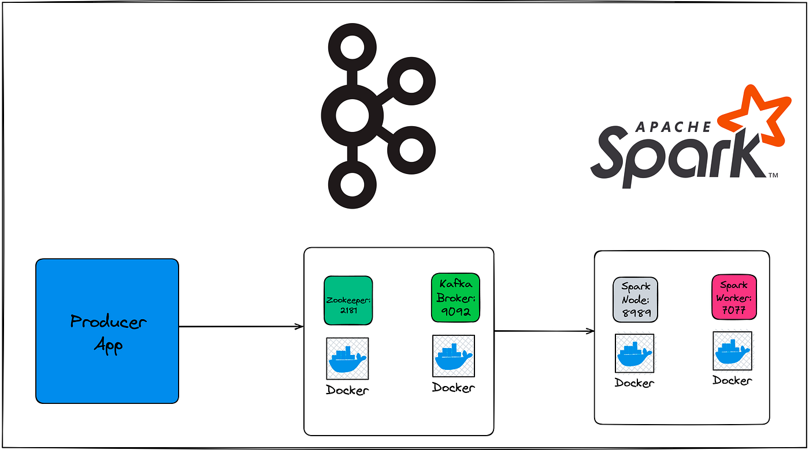

# Kafka Invoice Streaming Analysis with PySpark
This project demonstrates a real-time streaming data analysis pipeline using Apache Spark Structured Streaming and Kafka. It reads Fact_Invoice data, published as JSON messages, from a Kafka topic and performs a continuous aggregation to calculate the total sales and total tax amount for each seller. The results are then output to the console.

# Prerequisites
To run this application, you need to have the following installed and configured:

* Java Development Kit (JDK): Version 8 or higher.

* Apache Spark: Version 3.5.0 or higher.

* Apache Kafka: A running Kafka broker.

* Python 3.x: With the pyspark library installed (pip install pyspark).

* kafka-python library: To publish data to the Kafka topic (pip install kafka-python).

# Project Structure
* kafka_invoice_producer.py: A Python script that reads a CSV file (Fact_Invoice.csv) and publishes each row as a JSON message to a Kafka topic.

* Fact_Invoice.csv: A sample CSV file containing invoice data.

* kafka_invoice_streaming_analysis.py: The main PySpark application that consumes data from Kafka, processes it, and outputs the results.

# Setup and Usage
* 1. Start Kafka Broker
		Ensure your Kafka broker is running. You can typically start it using the following commands if you have a local installation:

* Start Zookeeper
		bin/zookeeper-server-start.sh config/zookeeper.properties

* Start Kafka broker
		bin/kafka-server-start.sh config/server.properties

* 2. Create the Kafka Topic
		Create the invoices topic that the producer and consumer will use.

		bin/kafka-topics.sh --create --topic invoices --bootstrap-server localhost:9092 --partitions 1 --replication-factor 1

* 3. Publish Data to Kafka
First, ensure you have the Fact_Invoice.csv file in the same directory as the kafka_invoice_producer.py script. Then, run the producer script to send the data to the Kafka topic.

		python kafka_invoice_producer.py

This will publish each row from the CSV file as a separate message.

* 4. Run the PySpark Streaming Application
Use spark-submit to run the kafka_invoice_streaming_analysis.py script. The --packages option is essential to include the necessary Kafka libraries for Spark.

		spark-submit --packages org.apache.spark:spark-sql-kafka-0-10_2.12:3.5.0 kafka_invoice_streaming_analysis.py

* 5. Analyze the Output
The PySpark application will start consuming messages from the invoices topic. Every 5 seconds, it will print a complete, updated table to your console showing the TotalSales and TotalTax for each SellerID. The output will look something like this:

			+--------+--------------------+------------------+
			|SellerID|          TotalSales|          TotalTax|
			+--------+--------------------+------------------+
			|     442|31921.480000000000|4163.670000000000|
			|     156|46356.010000000000|6046.440000000000|
			|     192|39356.550000000000|5276.250000000000|
			...

The application will continue to run and update the console output as long as new messages are published to the Kafka topic. To stop the application, you can terminate it with Ctrl+C.

# Code Explanation
* SparkSession: The entry point for all Spark functionalities.

* Schema Definition (invoice_schema): A StructType is used to define the structure and data types of the incoming JSON messages. This is crucial for PySpark to correctly parse the data.

* Kafka Stream (readStream): Reads data in a streaming fashion from the specified Kafka topic.

* JSON Parsing (from_json): Converts the raw Kafka message (binary data) into a structured DataFrame based on the defined schema.

* Date Formatting (to_date): The invoice_Date column is converted from a string to a proper date type, which is good practice for data processing.

* Streaming Aggregation (groupBy, agg): Aggregates the data over a continuous stream. Spark maintains the state of these aggregations to provide real-time updates.

* Output to Console (writeStream): The final stage that outputs the results of the streaming query.

* outputMode("complete"): This mode outputs the full, updated result table to the sink (console, in this case) on every trigger.

* trigger(processingTime="5 seconds"): This defines the micro-batch interval, meaning the streaming query will process new data every 5 seconds.

* awaitTermination(): Keeps the application running to continuously process the data stream until it is manually stopped.
